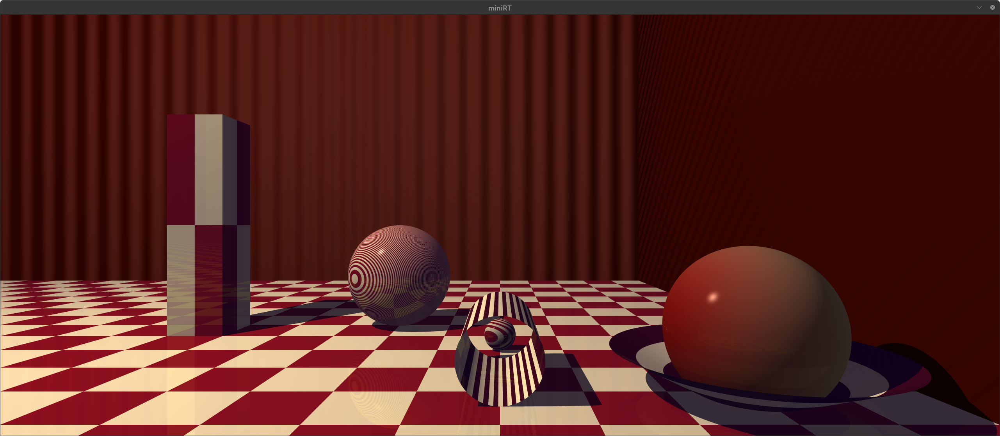
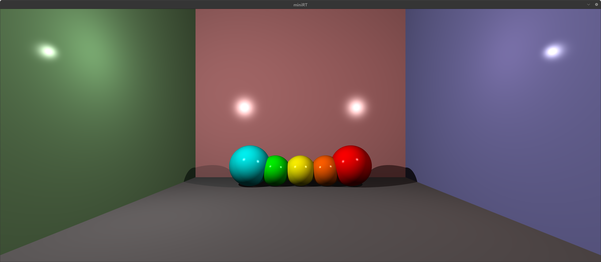
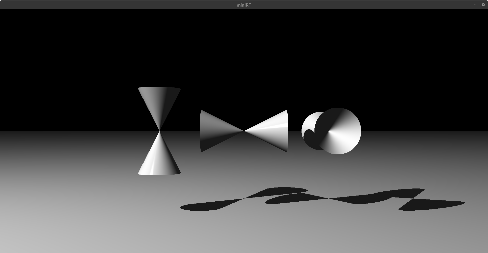
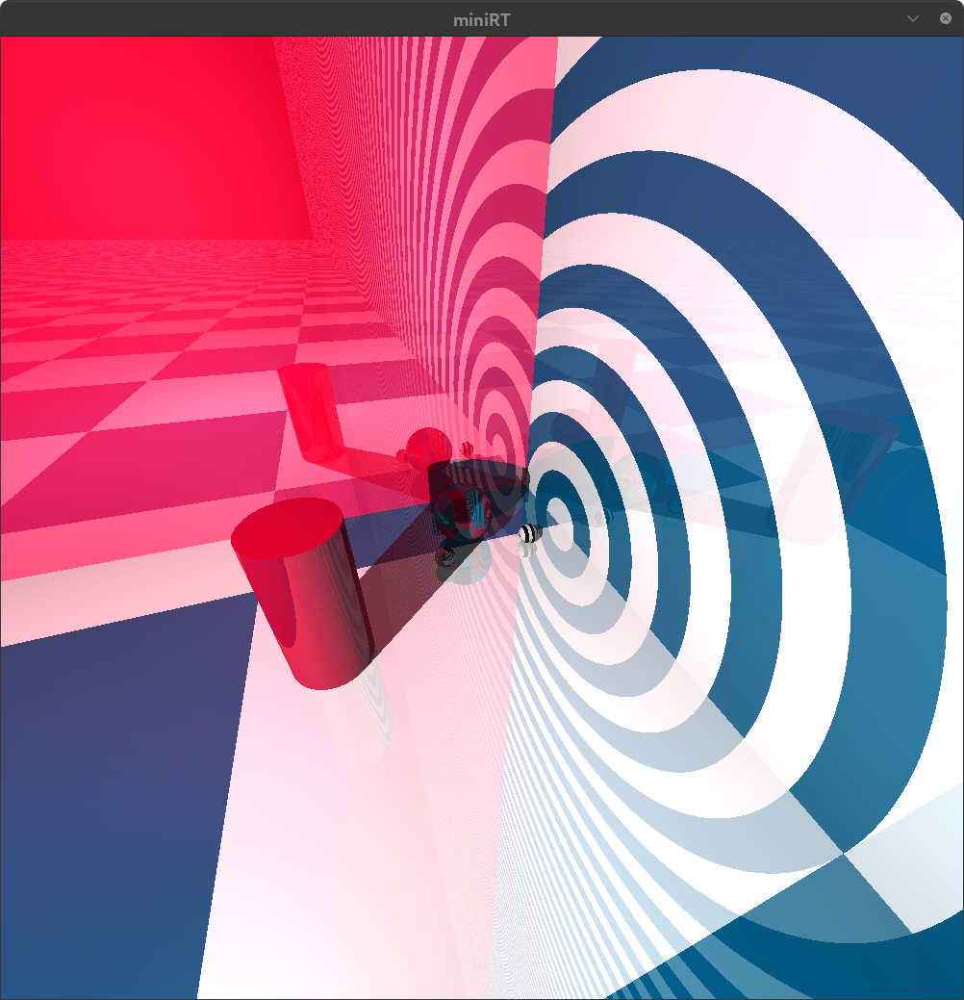
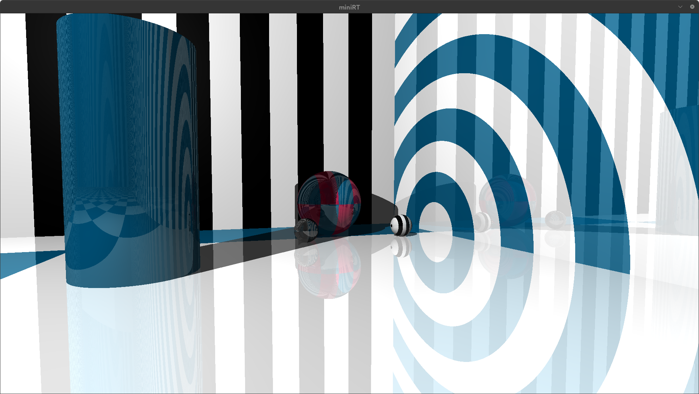

# miniRT

A minimal **ray tracer in C** using MLX42. Built from scratch as part of the 42 curriculum.

---

## 🧠 Description

**miniRT** is an introduction to **ray tracing**, a rendering technique that simulates the physical behavior of light to generate realistic 3D images.

Instead of approximating visuals like traditional rasterization, ray tracing computes how rays interact with objects, resulting in:
- realistic lighting
- accurate shadows
- reflections and depth

The goal of this project is to prove that complex mathematical systems can be implemented with solid fundamentals — without needing to be a mathematician.

---

## 🚀 Features

### ✅ Mandatory
- Scene parsing from `.rt` files
- Camera system (position, orientation, FOV)
- Lighting:
  - Ambient light
  - Diffuse shading
  - Hard shadows
- Objects:
  - Sphere
  - Plane
  - Cylinder
- Object transformations:
  - Translation
  - Rotation (when applicable)
- Real-time rendering in a MiniLibX window
- Clean error handling (`Error\n + message`)

---

### 🔥 Bonus (fully implemented + extended)
- Specular lighting (Phong model)
- Multiple light sources
- Advanced shading
- Checkerboard / procedural patterns
- Additional geometric objects
- Reflection effects
- Enhanced scene flexibility

---

## 🖼️ Renders

### Scene 1


### Scene 2


### Scene 3


### Scene 4


### Scene 5


---

## 📄 Scene Format (`.rt`)

Scenes are defined using a simple text-based format.

### Example:

```txt
# AMBIENT LIGHTING
# ambient_ratio					r,g,b
A	0.2							1,1,1

# CAMERA
#	vpx,y,z		ovx,y,z	fov
C	-2,2,-15		0,0,1	90

# LIGHT SOURCEz
#	x,y,z		brightness		r,g,b
L	-10,10,-10		1				255, 240, 196

# PLANE
#	x,y,zpos	x,y,z			r,g,b
pl	0,0,0		0,1,0			255,255,255
pl	0,0,3		1,0,0			62,7,3
pl	3,0,0		0,0,1			62,7,3

# # SPHERE
# #	x,y,z		radius			r,g,b
sp	1,0.75,-9	1				255,255,255
sp	-4,1,-5		1				255,255,255
sp	-2,0.25,-7	0.25			255,255,255

# CYLINDER
#	center_x,y,z	axis_x,y,z		diameter	height	r,g,b
cy	-2,0.5,-10		1,0,0			0.5	1		5		255,255,255

# CUBE
#	x,y,z		orientation		scale		r,g,b
cb	-7.5,2,-5.5		0,1,0	0.5,0.5,2		255,255,255	#unit cube

co	1,-0.33,-9		0,-1,0			0.33	0.33	255,255,255
Rules
Order does not matter
Flexible spacing & line breaks
Invalid input → clean exit with error


🧮 Core Concepts
Ray Casting

Each pixel sends a ray into the scene to determine color.

Intersections
Ray vs Sphere
Ray vs Plane
Ray vs Cylinder
Lighting Model
Ambient
Diffuse
Specular (bonus)
Math Used
Vector normalization
Dot products
Reflection vectors
